# 🧠 AI Knowledge Assistant (RAG) with Docker & Streamlit


**AI Knowledge Assistant** is a Retrieval-Augmented Generation (RAG) application designed to process, store, and chat with PDF documents. It combines the privacy of local vector embeddings with the intelligence of cloud-based LLMs (Llama 3.3 via OpenRouter).

Built with a focus on **DevOps best practices**, this project is fully containerized and ready for deployment.

---

## Key Features

* ** PDF Ingestion Engine:** upload documents, automatically split text into chunks, and generate vector embeddings locally.
* ** Hybrid Architecture:**
    * **Local Embeddings:** Uses `sentence-transformers` (CPU-optimized) to process data on your machine.
    * **Cloud Inference:** Sends only relevant context to OpenRouter API for high-quality answers.
* **Persistent Memory:**
    * **Vector DB:** ChromaDB stores semantic data locally.
    * **Chat History:** SQLite database saves conversation context between sessions.
* **Smart Retrieval:** Uses Cosine Similarity to find the most relevant information within documents.
* **Dockerized:** One-command deployment with zero dependency hell.

## Architecture

The system follows a modular RAG pipeline:

```mermaid
graph TD
    %% Стили и узлы (Везде добавлены кавычки!)
    User(["👤 User"]) <-->|Chat| UI["Streamlit Interface"]
    UI <-->|"Input/Output"| Logic["⚙️ App Logic (Python)"]
    
    subgraph "Privacy Zone"
        Logic <-->|"Read/Write History"| SQL[("🗄️ SQLite DB")]
        
        Logic -- "Raw Text" --> Splitter("✂️ Chunking Engine")
        Splitter --> Embed["🧠 HuggingFace Model (CPU)"]
        Embed -->|"Vectors"| VectorDB[("🔍 ChromaDB")]
        
        VectorDB -.->|"Relevant Context"| Logic
    end
    
    subgraph "☁️ External Cloud"
        Logic -- "Context + Query" <--> API{"🌐 OpenRouter API"}
        API <-->|"Inference"| LLM["Llama 3.3 70B"]
    end

    %% Стилизация
    style User fill:#f9f,stroke:#333,stroke-width:2px
    style Logic fill:#bbf,stroke:#333,stroke-width:2px
    style VectorDB fill:#dfd,stroke:#333,stroke-width:2px
    style SQL fill:#dfd,stroke:#333,stroke-width:2px
    style LLM fill:#ff9,stroke:#333,stroke-width:2px

```



## Tech Stack

**Language**: Python 3.10

**Frontend**: Streamlit

**Vector Database**: ChromaDB (Persistent Client)

**Relational Database**: SQLite (Chat History)

**ML Libraries**: PyTorch (CPU), SentenceTransformers, LangChain

**Containerization**: Docker & Docker Hub

---

## Quick Start

You can run this application using Docker (recommended) or locally with Python.

**Prerequisites**
An API Key from [OpenRouter](https://openrouter.ai/).

### Option 1: Docker CLI (PowerShell / Terminal)

Run this command in your terminal (PowerShell, Bash, or CMD). 
Replace sk-or-your-key with your actual API key.

```PowerShell
docker run -d `
  -p 8501:8501 `
  -e OPENROUTER_API_KEY=sk-or-v1-your_actual_key_here `
  zerol91/rag_chat_pdf:latest
```

**single-line option**
```PowerShell
docker run -p 8501:8501 -e OPENROUTER_API_KEY=your_openrouter_api_key zerol91/rag_chat_pdf:latest
```
**Note**: 
This command runs in "Ephemeral Mode". Data will be lost after stopping the container. To persist data, add volume mapping.

---

### Option 2: Docker Desktop (GUI)

Open Docker Desktop.
Search for zerol91/rag_chat_pdf in the search bar and click Pull.
Go to the Images tab and click the Run (Play) button.
Expand Optional settings and configure:
    Container name: my-rag-bot (for example)
    Ports: Host port: 8501
    Volumes: leave empty
    Environment variables:
        Variable: OPENROUTER_API_KEY
        Value: your_actual_key_starts_with_sk-or...
Click Run.

Open your browser at http://localhost:8501.

---

### Option 3: Local Development (Python)

**Clone the repository**:
```Bash
git clone [https://github.com/Zerol-91/RAG_LLM_PDF_Reader.git](https://github.com/Zerol-91/RAG_LLM_PDF_Reader.git)

cd My_RAG_PDF_Reader
```

**Set up environment**:
```Bash
# Create virtual env
python -m venv .venv

# Activate (Windows)
.venv\Scripts\activate

# Activate (Mac/Linux)
source .venv/bin/activate
```

**Install dependencies**:
```Bash
pip install -r requirements.txt
```

**Configure API Key**: Create a .env file in the root directory:
```
OPENROUTER_API_KEY=sk-or-v1-...
```

**Run the app**:

```Bash
streamlit run app.py
```
---

## Project Structure

```
├── app.py                 # Main application entry point
├── requirements.txt       # Python dependencies
├── Dockerfile             # Multi-stage build configuration
├── .dockerignore          # Build context optimization
└── README.md              # Documentation
```

## Privacy & Security

- **Your Data**: PDF documents are processed locally. Embeddings are stored on your machine/container.

- **❗Minimal Exposure**: Only the specific text snippets relevant to your query are sent to the OpenRouter API for answer generation.

- **API Key**: Your key is passed securely via Environment Variables and is never stored in the code.

- **Data Policy**: While only fragments are sent, users should refer to OpenRouter's Privacy Policy regarding data handling by LLM providers.
